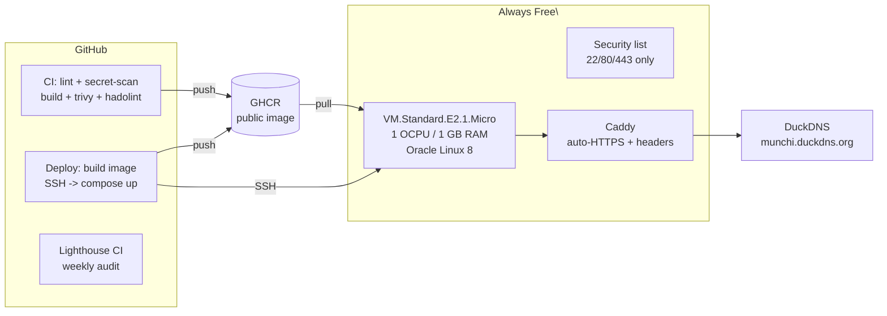

# 🎂 Munchi's Birthday Letter

A single-file, dependency-free birthday experience with a full **zero-cost DevOps stack** running on Oracle Cloud's Always Free tier.

> The letter is signed *— Chooti Kuku*. It was built as a one-off gift, then wrapped in a complete CI/CD + IaC + monitoring platform. The site itself (`index.html`) is treated as a sacred artifact — the pipeline builds *around* it, never modifies it.

## Architecture



**Flow:** push to `main` → CI lints/tests/scans/pushes the image → Deploy pushes a new tagged image and re-runs `docker compose up` over SSH with healthcheck + auto-rollback. Caddy terminates TLS via Let's Encrypt and serves the precompressed site. Lighthouse CI audits it weekly from outside.

## Repo layout

```
.
├── index.html                 # the letter — functionally untouched
├── Makefile                   # one-command dev/DX entrypoint
├── scripts/                   # build, smoke-test, deploy, rollback, healthcheck
├── Dockerfile                 # multi-stage: minify + precompress -> Caddy
├── docker/Caddyfile           # TLS, security headers, CSP, gzip/brotli
├── docker-compose.yml         # app + optional Uptime Kuma (profile: monitoring)
├── .github/
│   ├── workflows/ci.yml       # lint, gitleaks, build+test, hadolint, trivy, GHCR push
│   ├── workflows/deploy.yml   # SSH deploy with healthcheck + auto-rollback
│   ├── workflows/lighthouse.yml # weekly Lighthouse audits
│   └── dependabot.yml         # npm, Docker, GitHub Actions updates
└── infra/
    ├── terraform/             # OCI: compartment, VCN, security list, Always Free instance
    └── ansible/               # bootstrap: Docker, firewalld, fail2ban, auto-updates
```

## Cost: $0/month

| Service | Purpose | Cost |
|---------|---------|------|
| GitHub Actions | CI/CD, audits | free (public repo) |
| GHCR | container registry | free (public) |
| Oracle Cloud **Always Free** E2.1.Micro | 1 OCPU / 1 GB VM | $0 |
| DuckDNS | free dynamic DNS | $0 |
| Let's Encrypt | TLS certs | $0 |

This site runs on the 1 GB E2.1.Micro. The IaC defaults to the Ampere **A1.Flex**
(4 OCPU / 24 GB, also free) when A1 capacity is available in your home region;
`instance_shape` in `terraform.tfvars` is the switch. Deployed here in
`ap-sydney-1`.

## Prerequisites

- Docker (BuildKit), Docker Compose, Node.js ≥ 22, GNU Make
- `terraform` + `ansible` (only needed to provision the VM)
- Oracle Cloud account (Always Free capacity lives in your **home region** only; pick the region in `terraform.tfvars`)
- DuckDNS account (for the production domain)

## Local development

```bash
make setup      # install dev dependencies
make lint       # validate index.html
make build      # minify + gzip/brotli into dist/
make test       # build + smoke-test the bundle
make serve      # http://localhost:8080

make docker-build   # build the production image
make docker-run     # run it locally  (http://localhost:8080)
make docker-stop
```

`SITE_DOMAIN=localhost` (the default) makes Caddy serve plain HTTP on `:80`;
set it to your real domain and Caddy provisions HTTPS automatically.

## Deployment pipeline

1. **CI** (`ci.yml`) — on push/PR: `html-validate`, gitleaks secret scan, build + smoke test, hadolint, then a BuildKit build pushed to GHCR tagged `latest`, `sha-<sha>`, and `dev`; Trivy scans the image (CRITICAL-only exit gate, full SARIF uploaded).
2. **Deploy** (`deploy.yml`) — on push to `main`: builds/pushes a `sha-<sha>` tag, then `scripts/deploy.sh` SSHes to the VM, tags the running image as `app:prev`, pulls + force-recreates the `app` container, polls the healthcheck, and **auto-rolls-back** if it never comes up.
3. **Rollback** — `make rollback` (or `scripts/rollback.sh`) restores `app:prev`.

### GitHub Secrets to set

| Secret | Value |
|--------|-------|
| `VM_HOST` | `159.13.61.172` (the VM's public IP — DuckDNS resolves to it) |
| `VM_USER` | `opc` |
| `VM_SSH_PORT` | `22` |
| `VM_SSH_KEY` | the private key matching the public key Terraform injects |

The GHCR package must be public (one-time) so the VM can pull without a token:

```bash
gh api --method PATCH /user/packages/container/munchi-birthday \
  -f visibility=public
```

## Provisioning the VM (IaC)

```bash
cd infra/terraform
cp terraform.tfvars.example terraform.tfvars   # fill in tenancy_ocid, region, ssh_public_key
terraform init && terraform apply              # compartment, VCN, security list, Always Free instance

cd ../ansible
ansible-playbook playbooks/bootstrap.yml        # Docker, firewalld, fail2ban, auto-updates, first deploy
```

If A1 capacity is unavailable in your home region, set `instance_shape = "VM.Standard.E2.1.Micro"`
in `terraform.tfvars` (1 OCPU / 1 GB — enough for this static site; see the cost note above).

`bootstrap.yml` is idempotent — safe to re-run. It installs Docker, firewalld (allow 22/80/443 only), fail2ban for sshd, `dnf-automatic` security updates, hardens sshd (key-only, root disabled), and does the initial deploy of the container.

## Security

See [SECURITY.md](./SECURITY.md) for the full control map. Highlights: Caddy auto-HTTPS + HSTS, a strict CSP, no-storage/non-root read-only container, cloud security list + firewalld host firewall, fail2ban, gitleaks + Trivy + Hadolint in CI, Dependabot, and secrets that live only in GitHub Secrets / `.env` on the VM.

## Monitoring

- **Uptime Kuma** is *not* deployed here — the 1 GB E2.1.Micro has no headroom for it. The container stays covered by Docker's built-in healthcheck (deploy auto-rolls-back on failure) and weekly Lighthouse audits. On a bigger VM you can still add it: `docker compose --profile monitoring up -d` (internet-blocked, reachable via `ssh -L 3001:localhost:3001 opc@munchi.duckdns.org`).
- **Lighthouse CI** audits performance/accessibility/SEO weekly and on demand (`.github/workflows/lighthouse.yml`, assertions in `.lighthouserc.json`).

## Operations

See [docs/RUNBOOK.md](./docs/RUNBOOK.md) for day-2 ops: deploy, rollback, logs, DNS updates, cert renewal, and failure scenarios.

## Changelog

See [CHANGELOG.md](./CHANGELOG.md).

## License

© Pavara Mirihagalla. All rights reserved.
